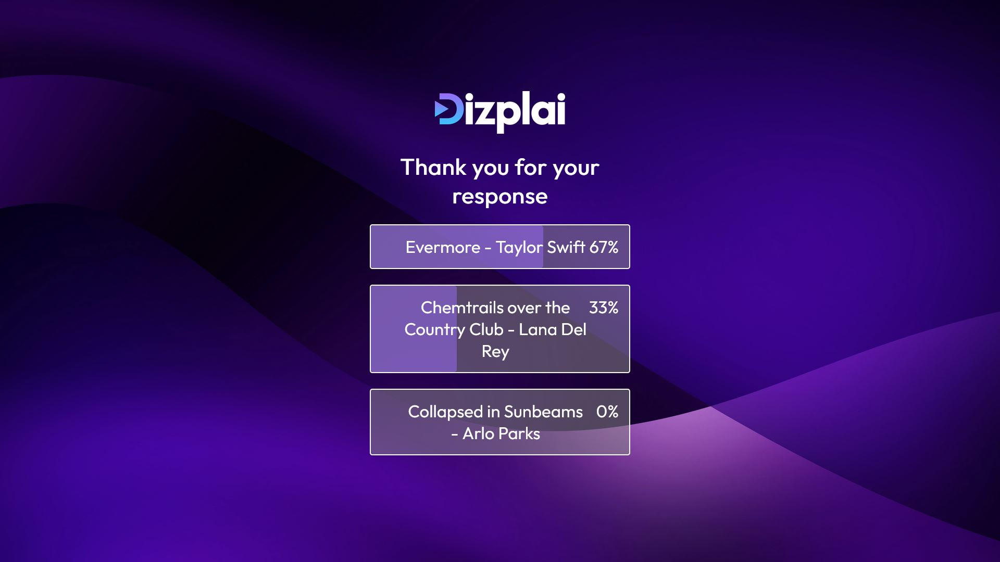

# Dizplai Polling Web App

Poll taking web app created as part of technical interview project for Dizplai

## Table of Contents

- [Introduction](#introduction)
- [Folder Structure](#folder-structure)
- [Getting Started](#getting-started)
  - [Prerequisites](#prerequisites)
  - [Installation](#installation)
- [Running the Project](#running-the-project)
- [Usage](#usage)
- [Tools Used](#tools-used)
- [Testing](#testing)
- [Points of interest](#points-of-interest)
- [Upcoming Feature List](#upcoming-feature-list)

## Introduction

Web app created using React and NodeJs to supply the user with multiple choice polls that the user can interact with.  
When the user submits their answer they are able to see the percentage of votes for each of the options.

[](./PublicItems/main.JPG)
[](./PublicItems/ResultScreenTest.JPG)

## Folder Structure

The repo is split into two folders for the Backend and Frontend

- The backend folder contains everything for running the API on the backend.
  - 'data' contains the two .json files that are used to store the poll questions and the votes
  - 'controllers' contains the logic for reading and writing to the files in 'data'
  - 'routes' contains the routing for the GET and POST requests
  - 'server.js' is the root file that runs the server on port 3001
- The Frontend folder contains the react app frontend that the user interacts with
  - 'public' contains basic files that shouldn't be touched by the dev
  - 'src' contains all the code that makes the react app run specifically index.js
    - 'Components' contains the components that change can change a lot from props and state variables such as button arrays
    - 'controllers' contains the apiController.js file which is responsible for all requests to the api

```plaintext
- Backend
  - controllers
    - pollController.js
    - voteController.js
  - data
    - polls.json
    - votes.json
  - routes
    - polls.js
    - votes.js
  - server.js
- Frontend
  - public...
  - src
    - Components
      - PercentageChoiceBar.jsx
      - QuestionBtn.jsx
    - Controllers
      - apiController.js
    - Pages
      - Poll.jsx
      - ResultPage.jsx
    - Styles
      - App.css
      - results.css
    - main.jsx
  - .env
  - .eslintrc.cjs
  - index.html
  - package-lock.json
  - package.json
  - vite.config.js
- .gitignore
- README.md
```

## Getting Started

### Prerequisites

Node.js and npm:

- https://nodejs.org/

### Installation

Frontend:

- cd Frontend
- npm install
- create .env file

Backend:

- cd Backend
- npm install

Enviroment:

```
VITE_SERVER_IP = http://_BACKENDIP_:3001
```

## Running The Project

The front end and back end are ran separately.  
Start up the backend first so you don't have to refresh the page on the front end.

Frontend:

- cd Frontend
- npm run dev

Backend:

- cd Backend
- node server.js

## Usage

You will be presented with one of the polls.  
Read the question then select an option and hit submit.  
The page will change to display the percentage popularity of each option.

you can change which poll/result you see by updating the url to include a different pollId

## Tools used

- Node.js
- React.js(Vite)

## Testing

Browser/Device Compatibility:

- Tested on 2 desktop computers and 3 mobile phones (android).
- Tested on 5 browsers: Chrome, Firefox, Edge, Samsung internet, Chrome mobile.

Functionality testing:

- Added test data for votes to see if the api fetches votes correctly.
- Added test data for polls to see if the api fetches polls correctly.

High detail unit/user testing seemed unnecessary due to simplicity in application and no custom user inputs.

## Points of interest

- Added file locking system to postVote so that data isn't lost when multiple users try to post at the same exact time.
- Because it's not expected that the polls will change often i added the ability to cache the polls when they are first read. However if they are updated after the cache is made it won't show the change until the server restarts due to there being, right now, no good way to check when the file is updated without large scale refactors.
  - refactor would require either server side or in the json file adding a lastmodified timestamp to it and only allowing the server itself to edit the file.

## Upcoming Feature List

- Page to select poll
  - Series of buttons (6 per page)
  - Pagination
- Ability to add/remove a poll
  - implemented the add poll
  - removing poll will mean a new caching mechanism is needed for immediate updates so that users dont vote on polls that dont exist anymore
    - (Simple) decrease cache refresh time & add cleanup script for votes on removed polls
    - (Complicated) implement cache invalidation or notification system
- Write queue for writing votes to the votes.json file
- system to limit ammount of votes sent per person/ip ideally 1 pp
